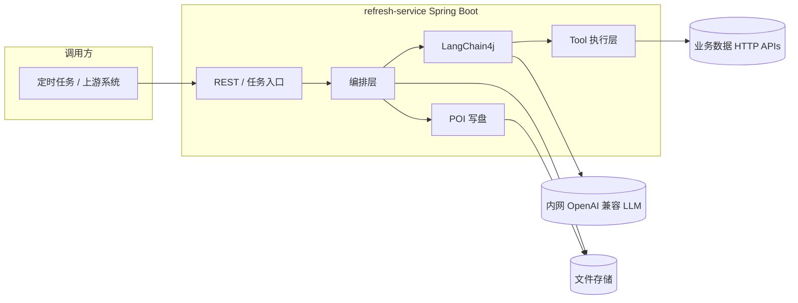
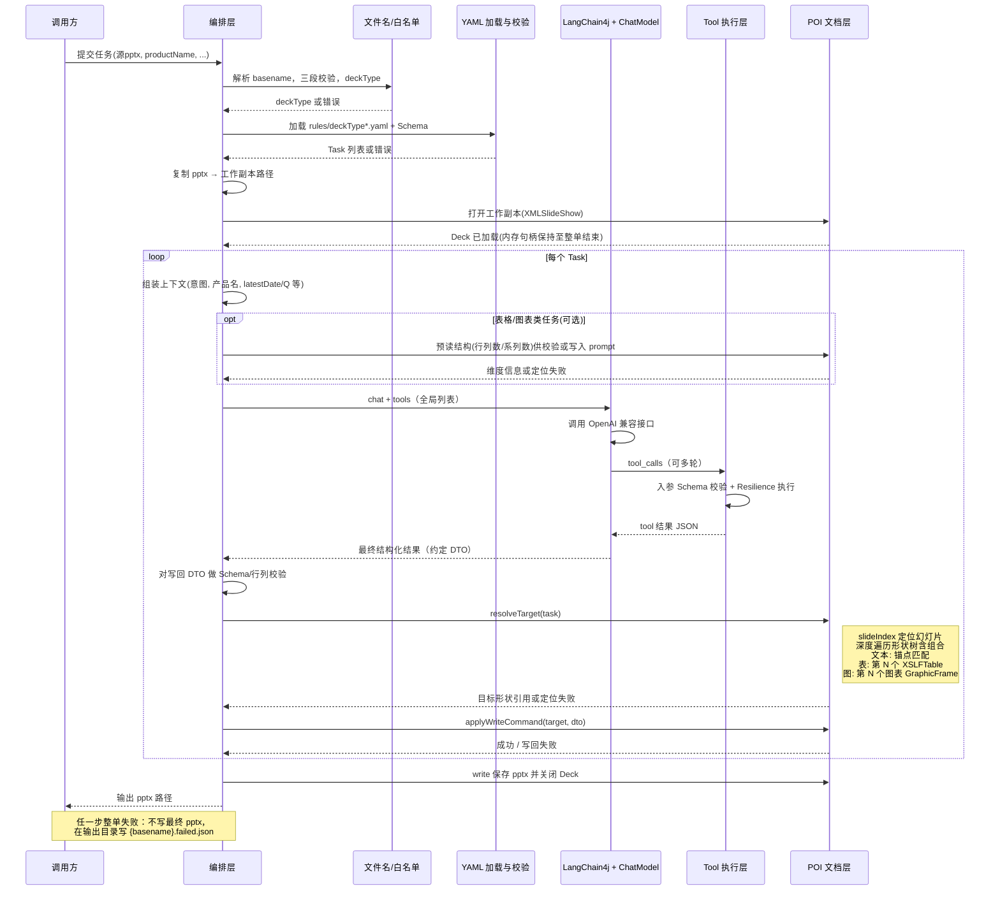

# PPT 数据更新与智能化取数 — 技术架构文档

> **关联文档**：业务与规则层面的约定见 [`ppt-data-refresh-design.md`](./ppt-data-refresh-design.md)（文件名、`deckType`、YAML 语义、无模板治理的定位策略等）。  
> **本文档**：在已确认的技术方向下，描述**逻辑/物理架构、组件职责、关键链路、技术栈、非功能需求与演进**，供研发实现与评审使用。

---

## 1. 架构目标与约束

### 1.1 目标

| 目标 | 说明 |
|------|------|
| **可扩展取数** | 新增数据源时，以 **注册 Tool** 为主扩展；避免为每种 PPT 维护「接口路由表」。 |
| **确定性写盘** | **LLM 不直接修改** pptx；所有落盘由 **Apache POI**（或等价库）按 YAML 定位信息写入。 |
| **可运维** | 支持内网 **OpenAI 兼容** 推理服务；具备超时、重试、日志与指标，便于排障与容量规划。 |
| **可演进** | 首期 **全局 Tool**；后续可叠加 **软收窄**、MCP 等，不推翻核心分层。 |

### 1.2 硬约束（与方案文档一致）

- 业务部门**不要求**对 PPT 做技术治理；定位依赖 **锚点文本** + **页内表/图序号** 等。
- 文件名 **basename** 按 `-` 切分 **必须恰好 3 段**，否则失败；`deckType = 段2-段3`（中间插 `-`）；段 2/段 3 **白名单**校验。
- 表格/图表首期 **仅替换已有单元格或数据点**，不改变行列与系列结构。

---

## 2. 技术栈总览

| 层级 | 选型 | 用途 |
|------|------|------|
| 运行时 / 框架 | **Java 17+**（建议）+ **Spring Boot 3.x** | HTTP/定时入口、DI、配置、监控、与组织内中间件集成 |
| LLM 接入 | **LangChain4j** + **OpenAI 兼容 `ChatModel`** | 对话、Tool/Function Calling、（可选）结构化输出 |
| 推理服务 | 内网 **OpenAI 兼容 API**（自定义 `baseUrl`） | Chat Completions；需验证 **tools** 能力 |
| 韧性 | **Resilience4j**（或 Spring Retry） | LLM 与业务 HTTP 的 **超时、重试、熔断/限流** |
| 规则与任务 | **YAML** + **JSON Schema**（或 Bean Validation） | 按 `deckType` 加载；启动或运行前校验 |
| 文档处理 | **Apache POI**（`poi-ooxml`） | 打开副本 pptx、定位形状、写文本/表格单元格、更新图表数据 |
| 序列化 | **Jackson** | JSON 与 DTO 映射 |
| 可观测性 | **Micrometer + 日志**（及组织内 APM/ELK 等） | 指标、链路关联 id、审计 |

**说明**：MCP 不作为首期必选；若后续 Tool 以 MCP Server 形式提供，可在「Tool 执行层」增加 **MCP 客户端** 实现，与 LangChain4j 的 LLM 调用解耦（见第 10 节）。

---

## 3. 逻辑架构（分层）

下列分层自顶向下调用；**禁止**上层绕过「校验与写盘」直接改 Office XML。

```text
┌─────────────────────────────────────────────────────────────┐
│  接入层 (Spring MVC / Scheduler / CLI)                      │
│  触发「刷新任务」、传参：源 pptx 路径、产品名、可选覆盖项      │
└────────────────────────────┬────────────────────────────────┘
                             │
┌────────────────────────────▼────────────────────────────────┐
│  编排层 (RefreshOrchestrator / Job Service)                    │
│  文件名解析 → deckType → 加载 YAML → 解析时间上下文            │
│  复制 pptx → 按任务列表循环 → 聚合结果 / 失败策略              │
└─────────────┬──────────────────────────────┬────────────────┘
              │                              │
┌─────────────▼──────────────┐   ┌───────────▼──────────────────┐
│  认知层 (LangChain4j)       │   │  文档层 (POI)               │
│  组装 System/User 消息      │   │  打开 XMLSlideShow          │
│  绑定全局 Tools             │   │  锚点解析 / 表图序号定位     │
│  调用 ChatModel (OpenAI 兼容)│   │  应用写回命令（纯代码）      │
│  解析 tool_calls 循环       │   │  保存到输出路径              │
└─────────────┬──────────────┘   └────────────────────────────┘
              │
┌─────────────▼──────────────────────────────────────────────┐
│  Tool 执行层 (Spring @Component / HttpToolExecutor)          │
│  Schema 校验入参 → HTTP/MCP → 校验响应 JSON → 返回 LLM/编排层 │
│  外层包 Resilience4j（超时、重试）                           │
└────────────────────────────────────────────────────────────┘
```

**职责边界**：

- **编排层**：事务边界（逻辑上「一次刷新任务」）、任务顺序、错误聚合；**不**包含具体 HTTP URL 与 LLM prompt 全文硬编码（prompt 模板可配置化）。
- **认知层**：仅负责「在已注册 Tool 定义下与模型交互」；**不**打开 pptx 文件。
- **文档层**：仅负责「根据结构化写回指令改 pptx」；**不**调用 LLM。
- **Tool 执行层**：真实 IO；统一鉴权、脱敏日志、重试策略。

---

## 4. C4 视角（精简）

### 4.1 系统上下文（System Context）

- **主体系统**：PPT 数据刷新服务（Spring Boot 应用）。
- **用户/调用方**：内部业务系统、运维定时任务、或经网关鉴权后的 REST 客户端。
- **外部依赖**：  
  - **内网 LLM 网关**（OpenAI 兼容）；  
  - **业务数据 API**（由 Tool 实现封装）；  
  - **文件存储**（源 pptx 与输出目录：本地盘、NAS 或对象存储 SDK，由部署决定）。

### 4.2 容器（Containers）

| 容器 | 说明 |
|------|------|
| **refresh-service** | 单个（或可水平扩展多个实例）Spring Boot 进程，内嵌上述分层逻辑。 |
| **llm-inference** | 组织内已部署的推理服务（对应用暴露 OpenAI 兼容 HTTP）。非本仓库实现，但为本系统关键依赖。 |
| **data-apis** | 现有业务后端；本系统通过 Tool 内 HTTP 客户端访问。 |

### 4.3 容器图（Mermaid）



---

## 5. 核心运行时序

### 5.1 单次「刷新任务」主序（Mermaid）



### 5.1.1 文档层：如何「解析」pptx 并拿到表格 / 图表（与主序对照）

主序里把 POI 工作拆成三步：**打开 Deck** → **`resolveTarget`（解析 + 定位）** → **`applyWriteCommand`（只改数据）**。下面说明第二步在实现上的约定（与 [`ppt-data-refresh-design.md`](./ppt-data-refresh-design.md) 中「无模板治理、锚点 + ordinal」一致）。

| 步骤 | 说明 |
|------|------|
| **打开** | 对工作副本 `new XMLSlideShow(InputStream)`（或等价），整单任务共用一个 `XMLSlideShow` 实例，避免重复解析 ZIP；结束前有 **write + close**。 |
| **定位幻灯片** | 按 YAML 的 `slideIndex`（全项目统一 0/1 起始）取 `ppt.getSlides().get(i)`。越界则本 Task 失败。 |
| **遍历形状树** | 从 `slide.getShapes()` 出发，对 **`XSLFGroupShape` 递归**进入子形状；保证组合内的表、图参与计数与锚点搜索。顺序采用 **POI 返回的迭代顺序**（即文档约定的 z-order / 形状树顺序），并在团队内**写死为「ordinal 定义」**，版本变更时作为契约测试。 |
| **文本锚点** | 在遍历中遇到 `XSLFTextShape`（或带文本的占位形状）时读纯文本；与 YAML 中 `anchorText` 做匹配（含「锚后替换 / 整段替换」策略）。需做 **存在且唯一** 校验（见方案文档）。 |
| **第 N 个表格** | 在同一幻灯片的深度遍历中，**每遇到 `XSLFTable` 计数 +1**，与 YAML 的 `tableOrdinal`（如 1-based 第 1 个表）对齐后返回该表引用。 |
| **第 N 个图表** | 对 `XSLFGraphicFrame` 判断是否为图表（如 `getChart()` 非空或按 OOXML 类型过滤），**每命中一个图表计数 +1**，与 YAML 的 `chartOrdinal` 对齐后得到 `XSLFChart` 用于改数。 |
| **预读结构（可选）** | 表格可在写回前读取 **行数/列数**；图表可读 **分类个数 / 系列数**（与首期「只换数、不改结构」一致）。用于：① 编排层对 LLM 返回矩阵做 **硬校验**；② 可选写入 User 提示，减少模型输出错位。 |

**不写进主序图但需知晓**：`resolveTarget` **只做定位与只读量测**；**不改**幻灯片结构。写单元格、改图表缓存仍全部在 `applyWriteCommand` 内完成，便于单测与失败回滚策略（整单失败时可直接丢弃未保存副本）。

### 5.2 LLM 与 Tool 多轮交互说明

- 单条 **文本类 Task** 可能触发 **多轮** `tool_calls`（例如先查产品 ID，再查指标）；LangChain4j 侧使用 **支持 tool 循环的 API 模式**（具体类名随版本查阅官方文档）。
- **每轮** Tool 返回应可被编排层转为 **写回中间模型**（例如「锚点替换用字符串」「表格用二维 List」「图表用系列数组」），再由 **文档层** 消费；避免把原始 JSON 直接塞给 POI 层解析，以保持层次清晰。

---

## 6. Spring Boot 模块建议（包结构）

以下为**逻辑包划分**，实现时可合并或拆子模块 Maven module。

```text
com.example.pptrefresh
├── api              # REST DTO、Controller、异常处理
├── job              # 定时任务、异步任务入口（可选）
├── orchestration    # RefreshOrchestrator、任务状态、复制文件
├── naming           # 文件名解析、deckType、白名单加载
├── rules            # YAML 加载、Schema 校验、Task 模型
├── time             # latestDate / latestQuarter 占位实现（可插拔）
├── llm              # LangChain4j 配置：ChatModel(baseUrl)、Tool 注册表、Prompt 组装
├── tools            # 各 Tool 的 @Tool 方法或 ToolSpecification + Http 客户端
├── document         # POI：锚点查找、ordinal 定位、表格/图表/文本写回
└── observability    # 指标、关联 id、审计日志切面
```

**依赖方向**：`api/job` → `orchestration` → `llm` / `document` / `tools`；`document` **不得**依赖 `llm`。

---

## 7. 配置体系

### 7.1 分层配置

| 配置类型 | 载体 | 内容示例 |
|----------|------|----------|
| 应用运行时 | `application.yml` + profile | LLM `base-url`、`api-key` 引用、连接池、Resilience4j 默认、规则目录路径 |
| 业务规则 | `rules/{deckTypeKey}.yaml`（或哈希文件名映射） | tasks、锚点、intent、hints、白名单可由独立 `registry.yaml` 维护 |
| Prompt 模板 | `classpath:prompts/*.txt` 或 YAML 内嵌 | 统一 System 底座；减少硬编码 |

### 7.2 密钥

- **禁止**将 LLM Key、业务 API Token 写入 `rules/*.yaml`；使用 **环境变量 / K8s Secret / Spring Cloud Config** 注入。

---

## 8. LangChain4j 与 OpenAI 兼容推理

### 8.1 连接方式

- 使用 **OpenAI 兼容** 的 `ChatModel` 实现，配置项包括：  
  - `baseUrl`：内网网关根地址（含路径前缀以网关为准）；  
  - `apiKey`：按组织规范（部分内网网关可固定占位）；  
  - `modelName`：部署侧提供的模型 id；  
  - `timeout`、`logRequests`（注意生产脱敏）。

### 8.2 Tool 注册

- **首期**：应用启动时注册 **全局 Tool 列表**（所有 `@Tool` 或编程式 `ToolSpecification` 均参与每次请求的工具模式）。
- **Tool 描述质量**直接影响误调率：名称、JavaDoc/描述字段应写清 **入参语义、返回 JSON 字段含义、何时调用**。

### 8.3 验证清单（Spike / CI）

1. **最小 Chat**：无 tool，验证连通与 TLS。  
2. **单 Tool 单轮**：验证 `tool_calls` 解析与执行。  
3. **双 Tool 链式**：验证多轮与编排层状态传递。  
4. **非法参数**：验证 Schema 拒绝与错误日志。

若推理服务 **不支持** tools，则必须在架构决策上 **回退**（例如改为「纯 HTTP 路由表」或「BFF 翻译层」），不能假定兼容。

---

## 9. 韧性（Resilience）与错误策略

### 9.1 建议策略

| 调用 | 超时 | 重试 | 说明 |
|------|------|------|------|
| LLM HTTP | 可配置（如 60–120s） | 有限次数 + 退避；仅对 **网络超时/5xx** | 避免对 **4xx/业务错误** 盲重试 |
| Tool 内业务 HTTP | 较短（如 5–30s） | 按接口幂等性决定 | 记录 `deckType`、taskId、tool 名 |

### 9.2 与业务方案对齐

- 文件名/YAML/锚点/Schema 任一步失败：**整单失败**（与方案文档「一律报错」精神一致）。  
- **不产出**最终路径上的半成品 pptx；丢弃或删除未完成的工作副本。  
- 在**输出目录**写入 **`.failed.json`** 诊断文件（与方案文档 §9.3 一致）；成功任务不写。

### 9.3 失败诊断文件（`.failed.json`）实现约定

编排层在捕获整单失败后，于输出目录写入 JSON（实现类建议 `FailureReportWriter`）。

**命名**：与预期输出 pptx **同 basename**，扩展名为 `.failed.json`（例：`…-out.pptx` → `…-out.failed.json`）。

**建议字段**（实现时可增删，但应保持向后兼容的 `version`）：

| 字段 | 类型 | 说明 |
|------|------|------|
| `version` | string | 报告格式版本，如 `"1"` |
| `failedAt` | string (ISO-8601) | 失败时间 |
| `traceId` / `jobId` | string | 与日志关联 |
| `deckType` | string | 解析得到的类型键 |
| `sourceFile` | string | 源 pptx 路径或对象键（按需脱敏） |
| `expectedOutputFile` | string | 本任务计划输出的 pptx 路径 |
| `productName` | string | 可选，任务入参 |
| `stage` | string | 失败阶段枚举，见下表 |
| `taskId` | string | 可选，失败所在 YAML task |
| `slideIndex` | number | 可选 |
| `errorCode` | string | 稳定错误码，便于监控聚合 |
| `message` | string | 可读说明（可含锚点缺失等） |
| `cause` | string | 可选，根因类名或摘要，**不含**完整堆栈 |
| `toolName` | string | 可选，Tool 阶段失败时 |
| `llmRequestId` | string | 可选，网关返回 |

**`stage` 建议枚举**：`FILENAME_PARSE` | `WHITELIST` | `RULES_LOAD` | `RULES_SCHEMA` | `DECK_OPEN` | `TASK_LLM` | `TASK_TOOL` | `TASK_DTO_VALIDATE` | `TASK_RESOLVE_TARGET` | `TASK_WRITE` | `DECK_SAVE` | `UNKNOWN`。

**安全**：禁止写入 API Key、完整 Tool 请求体、未脱敏客户敏感字段；堆栈仅写服务端日志，不进 JSON。

---

## 10. MCP 演进位（可选）

首期 **Tool = Java 方法内直接 HTTP** 即可满足多数场景。

若后续统一暴露 **MCP Server**：

- 在 **Tool 执行层** 增加 `McpToolAdapter`：实现与现有 `ToolExecutor` 相同接口，内部通过 **MCP Java Client** 调用 `tools/call`。  
- **LangChain4j** 仍只与「抽象 Tool 执行结果」交互，无需重写编排与 POI。

```text
LangChain4j ──tool_calls──► ToolDispatcher ──► HttpToolExecutor
                                    └──► McpToolAdapter (未来)
```

---

## 11. 软收窄（后续）

在 **不改变「YAML 不写 API 路由表」」** 的前提下：

1. 维护 **Tool 名称 + 描述** 的嵌入向量索引（或关键词倒排）。  
2. 每次请求前用 **当前 task 的 intent + hints** 检索 **Top-K** Tool。  
3. 仅将 Top-K 注册到当次 `ChatRequest`，降低误调与 token。

该模块独立为 `llm.toolselection` 包，通过特性开关启用。

---

## 12. 安全

| 项 | 做法 |
|------|------|
| 认证 | 刷新服务 API 使用组织统一认证（网关 JWT / mTLS 等） |
| 授权 | 按调用方限制可访问的 `deckType` 或目录（可选） |
| 数据 | pptx 可能含敏感信息；日志中 **不打印** 全文，仅路径与哈希 |
| LLM | 提示词中避免注入原始密钥；Tool 参数脱敏审计 |

---

## 13. 可观测性与审计

### 13.1 日志字段（建议）

- `traceId` / `jobId`  
- `deckType`、`sourceFileName`（非全路径若敏感）  
- `taskId`、`taskType`（text/table/chart）  
- `toolName`、**脱敏后**参数摘要、耗时、成功/失败码  
- LLM **request id**（若网关返回）

### 13.2 指标（Micrometer 示例意图）

- `ppt.refresh.job.count`（success/failure）  
- `ppt.refresh.task.duration`  
- `llm.chat.duration`、`llm.tool.calls`  
- `tool.http.errors`（按异常类型）

---

## 14. 部署视图（参考）

```text
                    [ 调用方 / K8s CronJob ]
                              |
                    [ Ingress / API Gateway ]
                              |
              +-------------+-------------+
              |   refresh-service Pod     |
              |   Spring Boot             |
              +-------------+-------------+
                            |
         +------------------+------------------+
         |                                     |
   [ LLM Gateway : OpenAI兼容 ]          [ 业务 API 集群 ]
         |                                     |
   [ GPU 推理集群 ]                    [ 现有服务与DB ]
```

- **水平扩展**：多实例时注意 **同一输出路径并发写** 问题；建议 **每任务唯一输出文件名**（时间戳 + UUID）。  
- **资源**：LLM 调用 CPU 轻、等待重；线程池或虚拟线程（JDK 21）可配置；限制全局并发保护推理集群。

---

## 15. 单体工程说明

| 说明 | 内容 |
|------|------|
| 代码入口 | **`com.example.pptrefresh`**：REST 刷新服务、`document` 写回、`llm` 与 `rules`。 |
| 图表数据写回 | **`ChartDataWriter`**：嵌入工作簿 + 柱状/折线图的 strCache/numCache 刷新（与常见 POI 实践一致）。 |
| 本地 Stub 联调 | **`RefreshSampleMain`**：读取 `samples/` 下样例 pptx，输出 `*-refreshed.pptx`。 |
| Maven 工件名 | `artifactId` 仍为 `autoppt`（历史仓库名），与 Java 包名无关。 |

---

## 16. 风险与架构决策记录（ADR 摘要）

| ID | 决策 | 理由 | 风险 |
|----|------|------|------|
| ADR-01 | LLM 不直接写 pptx | 保版式、可测试 | 需维护写回 DTO 与校验 |
| ADR-02 | OpenAI 兼容 + LangChain4j | 与私有化部署对齐、生态成熟 | 需验证 tool 能力 |
| ADR-03 | 首期全局 Tool | 扩展性优先 | 误调率可能偏高 → 软收窄 |
| ADR-04 | Resilience4j 包裹外部调用 | 避免级联故障 | 重试需区分幂等 |

---

## 17. 开放项（实现前确认）

- `slideIndex` **0-based 与 1-based** 在 YAML 与文档中统一。  
- 输出文件命名规范与保留期。  
- `.failed.json` 是否在失败时 **覆盖** 同路径旧文件（建议覆盖，并保留 `failedAt`）。  
- 对象存储 vs 本地路径的 **统一 `FileAccess` 抽象**。

---

## 18. 修订记录

| 日期 | 版本 | 说明 |
|------|------|------|
| 2026-05-15 | 0.1 | 初稿：Spring Boot + LangChain4j + OpenAI 兼容 + POI 分层架构 |
| 2026-05-15 | 0.2 | 主序图补充：打开 Deck、resolveTarget 解析表/图、可选预读维度；新增 5.1.1 文档层说明 |
| 2026-05-15 | 0.3 | 采纳 `.failed.json` 失败诊断（§9.3）；主序图补充失败分支说明 |
| 2026-05-15 | 0.4 | §15 更新：与单体 `pptrefresh` 实现对齐；废弃独立 autoppt 包说明 |
